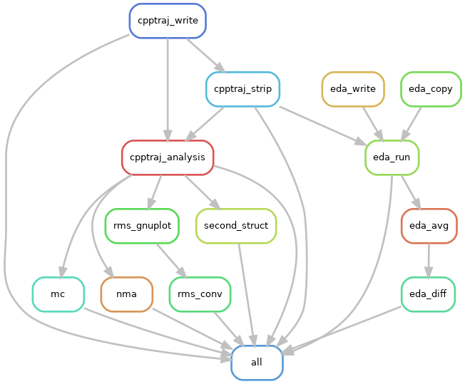

# AMBER Analysis Workflow

[](https://snakemake.readthedocs.io)

## Table of contents

* [About](#about)
* [What To Install](#what-to-install)
* [Before You Use](#before-you-use)
* [Getting Ready for Your System](#getting-ready-for-your-system)
* [:warning: File Naming Warning :warning:](#warning-file-naming-warning-warning)
* [Using Snakemake](#using-snakemake)
  * [Testing the Workflow](#testing-the-workflow)
  * [Removing Past Output](#removing-past-output)
* [Running on a Cluster (But Not the Snakemake Way)](#running-on-a-cluster-but-not-the-snakemake-way)
* [Citations](#citations)
  * [Python](#python)
  * [R](#r)
  * [Other](#other)
* [TODOs](#todos)


## About

This repository is a
[Snakemake](https://snakemake.readthedocs.io/en/stable/index.html)
workflow for working with AMBER MD analysis.

You will need to
[install `snakemake`](https://snakemake.readthedocs.io/en/stable/getting_started/installation.html)
with Python 3.x for your system.
Different components of this workflow also require an installation of R.

Currently, the `Residue_E_Decomp_openmp.f90` in the `scripts/` directory is a
blank file for testing.
You can download the actual script from
the [Cisneros Group's GitHub](https://github.com/CisnerosResearch/AMBER-EDA).

The base directory is the entry point for this workflow.
- `analysis`: contains the output from analyses.
- `config`: configuration files.
  The `.tsv` files should be used to give the workflow a "map" of your directory
  tree.
- `rules`: contains the rules for `snakemake` and any required function
  definitions.
- `scripts`: the base scripts that generate system-specific scripts.
  This is where you would modify specific analyses or figure-rendering.
  They are written to take system arguments for the things specified in the
  `config/config.yaml` file that would be unique for a given project.

It is recommended that you use the
[PyCharm (Community)](https://www.jetbrains.com/pycharm/download/) IDE
when editing these files, and adding the recommended plugins for Snakemake and
TSV files.
This will make debugging way, way easier!


## What To Install

Following the `snakemake` recommendations, you should set up a `conda`
environment.
```bash
# Create a new environment named `snakemake` and install `snakemake` into it
$ conda -n snakemake snakemake
# Activate the environment
$ conda activate snakemake
# Install the packages needed for plotting scripts
$ conda install matplotlib
$ conda install prody
$ conda install statsmodels
```

If you are going to install this *today*, you will want to use the GitHub
version of Prody due to an error when parsing NMD file in the 2.0 release.
Instead of `conda install prody`, instead do:
```
$ conda activate snakemake
$ conda install git pip
$ pip install git+https://github.com/prody/ProDy.git
```

## Before You Use

The `scripts/` directory contains the scripts for the analysis.
If you have specific analyses or plotting needs, you will want to modify
these scripts.
For example, if you want to plot distances for a specific atom pair,
you will want to add that into the `write_analy_traj` function of
`write-cpptraj.py`.
Similarly, if you know you need specific axes for plots, you will want to
add those to the relevant scripts.

If you want to set up variables as part of a `.tsv`, then that process will
require a bit more work, including:
- Adding the code to read the new `.tsv` starting with a `Path` column that
  matches `systems.tsv`
- Storing the newly read `.tsv` as a dictionary
- Get snakemake to parse the dictionary when iterating through the systems
- Adding system arguments to the Python scripts
- Adding those system arguments into the appropriate `rules/*.smk` file


## Getting Ready for Your System
The `config` directory contains 3 files:
- `config.yaml`: contains options and descriptions for configuring the workflow
- `EDAvalues.tsv`: a tab separated file with 5 columns of information necessary
  to set up the files for Energy Decomposition Analysis (EDA). Keep the header!
These columns include:
    - `Path`: The path within the analysis tree where the files should be saved.
      A typical path should look like `System/replicate`. This block
      **must match** the `Path` specified in `systems.tsv`.
    - `NRES`: The number of non-solvent residues that you want to look at for
      the EDA. (Ex: 455)
    - `NATOM`: The total number of atoms in the trajectory. (Ex: 51348)
    - `NPROTAT`: The number of atoms in the non-solvent portion of residues
      selected in `NRES`. (Ex: 5880)
    - `TOTRES`: The number of total residues in the trajectory. (Ex: 20348)

  `NRES` and `NATOM` can be identified from the `.prmtop` file, but typically
the system will need to be converted to a PDB to determine `NRES` and `TOTRES`.

- `systems.tsv`: a tab separated file with 5 columns of information necessary
  to set up the file paths for various analyses. This is effectively a roadmap
  for the directory tree. Keep the header!
  - `Path`: The path within the analysis tree where the files should be saved.
      A typical path should look like `System/Replicate`. This block
      **must match** the `Path` specified in `EDAvalues.tsv`.

    (Ex: `WT_r1`)

  - `System`: The system that the analysis is being performed on.
    This should match the first part of `Path` (prior to the slash).
    An example of different systems would be `WT`, `MUTA`, and `MUTB`.

    (Ex: `WT`)

  - `Replicate`: The replicate.
    For the R-based EDA rules, particularly, you need at least 3 replicates.
    This should match the second part of `Path` (after the slash).

    (Ex: `r1`)    

  - `Parm_Path`: The full system path to the trajectory files for a particular
    `System/Replicate`.
    The `prmtop`, `inpcrd`, and `nc` or `mdcrd` files should be in the same
    directory.

    (Ex: `/home/$USER/project/system/replicate`)

  - `Sys_Tag`: The "tag" for files written in a shared directory that
    distinguishes one system type from another.
    Typically, this will look like a combination of the `PROJ_ID` specified in
    the `config/config.yaml` and the `System`.

    (Ex: `ProteinID_WT`)


## :warning: File Naming Warning :warning:

 You MUST have consistent file naming across all systems and replicates!!
 **THIS IS CRUCIAL TO THE WORKFLOW!!!!!**
 You can modify the scripts a little bit, but it's set up for stuff like this:
- Prmtop: `{tag}{fs}{system}{post_e}.prmtop`
  - Ex reps 1: crambin-WT-wat.prmtop, crambin-H39C-wat.prmtop
  - Ex reps 2: crambin_WT.prmtop, crambin_H39C.prmtop


- Inpcrd: `{tag}{fs}{system}{post_e}.inpcrd`
  - Ex reps 1: crambin-WT-wat.inpcrd, crambin-H39C-wat.inpcrd
  - Ex reps 2: crambin_WT.inpcrd, crambin_H39C.inpcrd


- Traj (mdcrd/nc): `{tag}{fs}{system}{post_e}{fs}md{num}.{f_ext}`
  - Ex reps 1: crambin-WT-wat-md50.mdcrd, crambin-H39C-wat-md50.mdcrd
  - Ex reps 2: crambin_WT_md50.nc, crambin_H39C_md50.nc

| Variable      | Explanation                                                          |
| ------------- |----------------------------------------------------------------------|
| `tag`         | The project identifier for a file, to keep things findable.          |
| `fs`          | A file separator. Common examples are `-`, `_`, and `.`              |
| `system`      | What system the files are for (like wild type or a specific mutant). |
| `post_e`      | A pre-extension. Often these are used to specify solvation.          |
| `num`         | The number of the trajectory file, since we write in short chunks.   |
| `f_ext`       | The file extension type. You might save using `nc` or `mdcrd`.       |

 Basically, don't interchange between the examples.
 If you did, you'll want to rename all your files SAFELY.
 Do NOT think *"oh this loop is safe"* without testing it **AWAY** from your
 data first!!!
 You may think it'll work fine, but that's a really easy way to overwrite or
 delete your data in 10 seconds.

The `rename` command (which doesn't exist in all systems...) can be useful
for doing this.
It takes the current naming you want to switch, the thing you want to switch
it to, and the files it should be applied to as arguments.

```bash
$ ls
thing-name-2020-want.inpcrd  thing-name-2020-want_md3.nc
thing-name-2020-want_md1.nc  thing-name-2020-want.prmtop
thing-name-2020-want_md2.nc
$ rename thing-name-2020-want proteinID-WT-wat thing-name-2020-want*
$ ls
proteinID-WT-wat.inpcrd  proteinID-WT-wat_md2.nc  proteinID-WT-wat.prmtop
proteinID-WT-wat_md1.nc  proteinID-WT-wat_md3.nc
$ rename _md -md proteinID-WT-wat_*
$ ls
proteinID-WT-wat.inpcrd  proteinID-WT-wat-md2.nc  proteinID-WT-wat.prmtop
proteinID-WT-wat-md1.nc  proteinID-WT-wat-md3.nc
```

## Using Snakemake

You can use `snakemake -np` as a dry-run.
It will verify that all files are present and show commands to be executed.
If files are missing in the expected paths, it will print a warning.

Each rule can be used alone with something like:
```
snakemake <rule> --cores 1
```
There's a whole host of different options in the
[snakemake documentation](https://snakemake.readthedocs.io/en/stable/).

### Testing the Workflow
You can create a PDF of how Snakemake thinks your workflow links together:
```
snakemake --forceall --dag | dot -Tpdf > dag.pdf
```
You can also make a PNG by changing the file type.
```
snakemake --forceall --dag | dot -Tpng > dag.png
```
This is a *great* way to check for errors!





### Removing Past Output
You can test deleting output from snakemake with:
```
snakemake cpptraj_write --delete-all-output --dry-run
```
And actually do it with:
```
snakemake cpptraj_write --delete-all-output --cores 1
```

This particular workflow has a `clean` rule, which will remove the previous
analyses.
Be careful, though, as this will remove any generated input scripts or
trajectory files.
You can rewrite the rule for yourself in `rules/common.smk`.
```
snakemake clean --cores 1
```


## Running on a Cluster (But Not the Snakemake Way)

Part of what this workflow does is build the specific queue submission scripts
for each job, since each job type has different needs.
While `snakemake` can run through a cluster system, this approach seemed ideal
when dealing with specific workflow rules, especially those pertaining to EDA.
However, because of this atypical approach to snakemake, we want to set the
`output-wait` flag so that it knows that it might take a while for certain
jobs to run.
This may backfire!
If you don't see any other jobs in the queue from the snakemake job for a
few minutes, you may want to end the job and investigate.

Similarly, because interactive jobs are dependent on the VPN, we can submit
the overall `snakemake` job through the queuing system.

```bash
#!/bin/bash
#PBS -q my_cpu_alloc
#PBS -l nodes=1:ppn=1,mem=6GB
#PBS -j oe
#PBS -r n
#PBS -o err.error
#PBS -N proteinID_smk

cd $PBS_O_WORKDIR

## Use this to evaluate the conda commands
# eval "$(conda shell.bash hook)"
source ~/.bash_profile

## Set-up conda environment
# conda create -n snakemake snakemake

## Activate the conda environment
conda activate snakemake

## Run snakemake
## Output wait time is in seconds
## Wait 2 hours for new files: 7200
## Wait 24 hours for new files: 86400
snakemake --cores 1 --output-wait 7200
```

## Citations
### Python
- Cite [`snakemake`](https://snakemake.readthedocs.io/en/stable/project_info/citations.html)
  for their powerhouse software
- Cite [`pandas`](https://pandas.pydata.org/about/citing.html) for their
  beautiful TSV reading functions
- Cite [`numpy`](https://numpy.org/citing-numpy/) for all things math
- Cite [`matplotlib`](https://matplotlib.org/stable/citing.html) for the
  figures it helped make
- Cite [`statsmodels`](https://www.statsmodels.org/stable/index.html#citation)
  for their hand in the matrix correlation figures
- Cite [`prody`](http://prody.csb.pitt.edu/manual/about/citing.html) for
  doing the normal mode analysis

### R
- Cite [`R`](https://cran.r-project.org/) itself for existing in the world
- Cite [`tidyverse`](https://tidyverse.tidyverse.org/authors.html) for
  changing the game of data table processing
- Cite [`data.table`](https://cran.r-project.org/package=data.table) for
  reading EDA data with ease
- Cite [`abind`](https://cran.r-project.org/package=abind) for helping to
  process the EDA data

### Other
- The `Residue_E_Decomp_openmp.f90` program (an empty file here to check the
  workflow) can be downloaded from the
  [Cisneros Group's GitHub](https://github.com/CisnerosResearch/AMBER-EDA).
  The citation information is shared there.

## TODOs

- Write some scripts for renaming files to the syntax required for this workflow
- Add more analysis and test on a **real** system
- Test on a cluster
- Create (and test!) the environment files
- Add SLURM and LSF examples to scripts for bash
